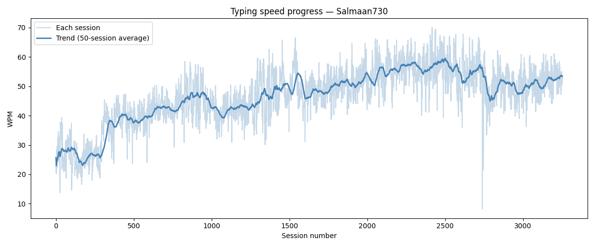

# Typing Progress Analyzer

Analyzing my keybr touch-typing practice data with Python.

## My progress across 3,253 sessions

## What this does
- Loads keybr JSON export data
- Calculates real WPM from raw session data
- Identifies shakiest keys by miss rate
- Visualizes speed trend across all sessions

## Key finding
First session: 25.7 WPM → Latest: 52.7 WPM → Personal best: 70.0 WPM

## Shakiest keys
!, S, T, Q, - (needs targeted practice)
